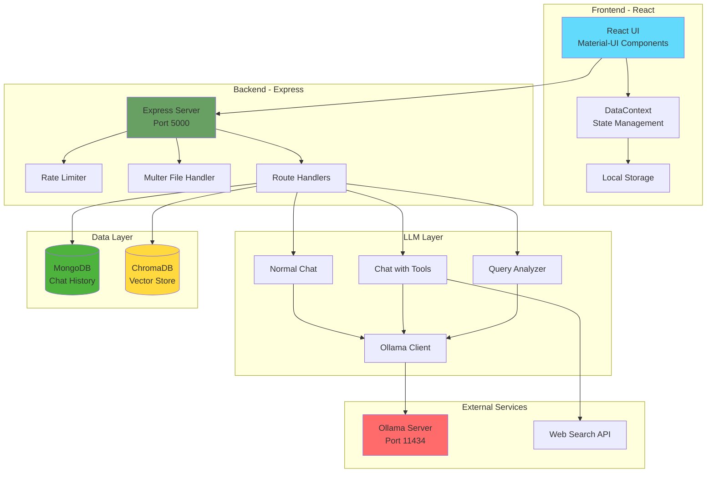

# NodeExpressReactLLM

A full-stack AI-powered chat application with advanced document understanding, web search, and multi-modal capabilities powered by Ollama LLMs.


## 🌟 Key Features

### 💬 **Intelligent Chat Interface**
- Real-time streaming responses with Server-Sent Events (SSE)
- Support for multiple Ollama models with dynamic switching
- Customizable system prompts for different use cases
- Persistent chat history with MongoDB

### 📚 **Document Q&A (RAG System)**
- Upload and analyze PDF, DOCX, and TXT files
- Intelligent document chunking with overlap for context preservation
- Vector embeddings using ChromaDB and Ollama embeddings
- Smart query routing (VECTOR_FACT, SUMMARY, NONE) for optimal retrieval
- Semantic search across uploaded documents

### 🔍 **Web Search Integration**
- Automatic web search via tool calling when needed
- Real-time information retrieval from the internet
- Seamless integration with LLM responses

### 🖼️ **Multi-Modal Support**
- Image analysis and understanding with vision models
- Support for JPEG, PNG, GIF formats
- Automatic image description and content extraction

### 🔗 **URL Content Extraction**
- Fetch and analyze content from provided URLs
- Automatic content summarization and integration

### 🎯 **Smart Features**
- Intelligent query analysis and routing
- Rate limiting for API protection
- File attachment support (up to 5 files, 10MB each)
- Responsive Material-UI interface
- Local storage for offline data persistence

## 🏗️ Architecture



## 🚀 Quick Start

### Prerequisites

- **Node.js** >= 18.0.0
- **Docker** and **Docker Compose** (for containerized deployment)
- **Ollama** installed and running locally or accessible via network
- **MongoDB** instance (local or Atlas)
- **ChromaDB** server running on port 27011

### Installation

#### Option 1: Docker Deployment (Recommended)

1. **Clone the repository**
```bash
git clone https://github.com/RameshShrestha/NodeExpressReactLLM.git
cd NodeExpressReactLLM
```

2. **Start services with Docker Compose**
```bash
docker compose up --build -d
```

3. **Access the application**
- Frontend: http://localhost
- Backend API: http://localhost:5000

#### Option 2: Local Development

1. **Clone and install dependencies**
```bash
git clone https://github.com/RameshShrestha/NodeExpressReactLLM.git
cd NodeExpressReactLLM
npm install
```

2. **Configure environment variables**

Create `.env` file in `llmserver/` directory:
```env
PORT=5000
OLLAMA_BASE_URL=http://localhost:11434
MONGODB_URI=mongodb://localhost:27017/llmchat
ENVIRONMENT=development
DEBUG_MODE=false
```

3. **Start Ollama and pull models**
```bash
# Start Ollama service
ollama serve

# Pull required models
ollama pull granite4.1:8b
ollama pull nomic-embed-text:latest
```

4. **Start ChromaDB**
```bash
# Using Docker
docker run -p 27011:8000 chromadb/chroma
```

5. **Start the application**
```bash
# Start backend
npm run dev:backend

# In another terminal, start frontend
npm run dev:frontend
```

6. **Access the application**
- Frontend: http://localhost:5173 (Vite dev server)
- Backend API: http://localhost:5000

## 📖 Usage Examples

### Basic Chat
1. Open the application in your browser
2. Select a model from the dropdown
3. Type your message and press Enter or click Send
4. Watch the response stream in real-time

### Document Q&A
1. Click the attachment icon
2. Upload PDF, DOCX, or TXT files (up to 5 files)
3. Wait for processing and embedding
4. Ask questions about the document content
5. The system automatically retrieves relevant context

### Image Analysis
1. Click the attachment icon
2. Upload an image (JPEG, PNG, GIF)
3. Ask questions about the image or request analysis
4. The vision model will describe and analyze the image

### Web Search
1. Ask a question requiring current information
2. The system automatically detects the need for web search
3. Tool calling fetches relevant web content
4. Response includes up-to-date information

## 🔧 Configuration

### Essential Environment Variables

**Backend (`llmserver/.env`)**
```env
PORT=5000                                    # Backend server port
OLLAMA_BASE_URL=http://localhost:11434      # Ollama server URL
MONGODB_URI=mongodb://localhost:27017/llm   # MongoDB connection string
ENVIRONMENT=development                      # development or production
DEBUG_MODE=false                            # Enable detailed logging
```

### Model Selection

The application supports any Ollama model. Popular choices:
- `granite4.1:8b` - Fast, efficient for general tasks
- `llama3.2:latest` - Excellent reasoning capabilities
- `qwen2.5:latest` - Strong multilingual support
- `llava:latest` - Vision model for image analysis

Pull models using:
```bash
ollama pull <model-name>
```

## 📚 API Endpoints

### Core Endpoints

| Endpoint | Method | Description |
|----------|--------|-------------|
| `/getLLMResponse` | POST | Main chat endpoint with streaming support |
| `/getModels` | GET | List available Ollama models |
| `/status` | GET | Server health check and metrics |
| `/chathistory` | GET | Retrieve all chat sessions |
| `/chathistory/:id/chatItem` | GET | Get messages for specific chat |
| `/chathistory/:id/clear` | POST | Clear chat history and embeddings |
| `/chathistory/:chatID` | DELETE | Delete a chat session |

For detailed API documentation, see [TECHNICAL.md](./TECHNICAL.md)

## 🛠️ Technology Stack

### Backend
- **Node.js** 18+ with ES Modules
- **Express.js** 5.2.1 - Web framework
- **Ollama** 0.6.3 - LLM integration
- **MongoDB** with Mongoose 9.6.1 - Chat persistence
- **ChromaDB** 3.3.3 - Vector database
- **Multer** 2.1.1 - File upload handling
- **Axios** 1.13.2 - HTTP client
- **Cheerio** 1.2.0 - Web scraping
- **pdf-parse** 2.4.5 - PDF text extraction
- **mammoth** 1.12.0 - DOCX processing

### Frontend
- **React** 19.2.0 - UI framework
- **Vite** 7.2.4 - Build tool
- **Material-UI** 7.3.6 - Component library
- **@emotion** - CSS-in-JS styling

### Infrastructure
- **Docker** & **Docker Compose** - Containerization
- **Nginx** - Frontend web server (production)

## 📁 Project Structure

```
NodeExpressReactLLM/
├── llmserver/                 # Backend Express server
│   ├── index.js              # Main server entry point
│   ├── LLM/                  # LLM integration modules
│   │   ├── normalchat.js     # Chat handlers
│   │   ├── embedding.js      # Vector embeddings
│   │   └── tools.js          # Tool definitions
│   ├── routes/               # API route handlers
│   │   ├── handleLLMCall.js  # Main chat route
│   │   ├── chatHistoryDB.js  # History management
│   │   └── getDetailFromURL.js # URL content fetcher
│   ├── FileHandlers/         # File processing
│   │   └── fileManager.js    # PDF/DOCX/TXT handler
│   ├── MongoModels/          # Database schemas
│   │   └── ChatMessageLLMModel.js
│   └── websearch.js          # Web search integration
├── webllm/                   # Frontend React app
│   ├── src/
│   │   ├── App.jsx           # Main app component
│   │   ├── Components/       # UI components
│   │   │   ├── CenterContent.jsx
│   │   │   ├── ChatContainer.jsx
│   │   │   ├── ChatHistory.jsx
│   │   │   └── ...
│   │   └── Dataprovider/     # State management
│   │       ├── DataContext.jsx
│   │       └── LocalStorage.js
├── docker-compose.yml        # Docker orchestration
├── Readme.md                 # This file
└── TECHNICAL.md              # Detailed technical docs
```

## 🔒 Security Features

- **Rate Limiting**: 100 requests per 15 minutes per IP
- **File Validation**: Type and size restrictions on uploads
- **Input Sanitization**: Multer middleware for safe file handling
- **Error Handling**: Global error middleware with proper status codes
- **CORS Configuration**: Configurable cross-origin policies

## 🐛 Troubleshooting

### Common Issues

**Ollama Connection Failed**
```bash
# Check if Ollama is running
curl http://localhost:11434/api/tags

# Start Ollama
ollama serve
```

**ChromaDB Connection Error**
```bash
# Start ChromaDB with Docker
docker run -p 27011:8000 chromadb/chroma
```

**MongoDB Connection Issues**
- Verify MongoDB is running: `mongosh`
- Check connection string in `.env`
- Ensure network connectivity

**File Upload Fails**
- Check file size (max 10MB)
- Verify file type (PDF, DOCX, TXT, images only)
- Ensure `uploads/` directory exists and is writable

## 📄 Documentation

- **[TECHNICAL.md](./TECHNICAL.md)** - Comprehensive technical documentation
  - Detailed API reference
  - Database schemas
  - Architecture deep-dive
  - Development guidelines
  - Deployment strategies

## 🤝 Contributing

Contributions are welcome! Please feel free to submit a Pull Request.

## 📝 License

ISC License

## 👨‍💻 Author

**Ramesh Shrestha**
- Email: fx_ra@hotmail.com
- GitHub: [@RameshShrestha](https://github.com/RameshShrestha)

## 🙏 Acknowledgments

- [Ollama](https://ollama.ai/) - Local LLM runtime
- [ChromaDB](https://www.trychroma.com/) - Vector database
- [Material-UI](https://mui.com/) - React component library
- [Express.js](https://expressjs.com/) - Web framework

---

**⭐ Star this repository if you find it helpful!**
