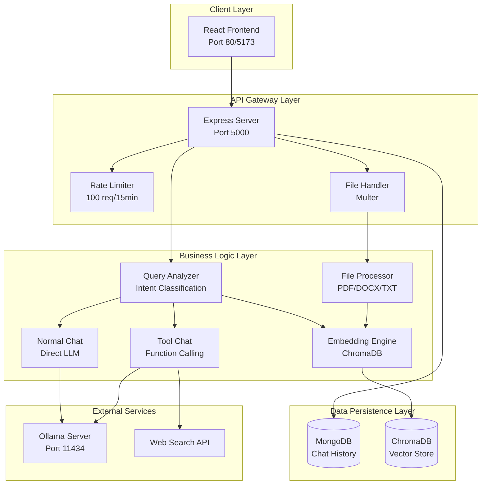
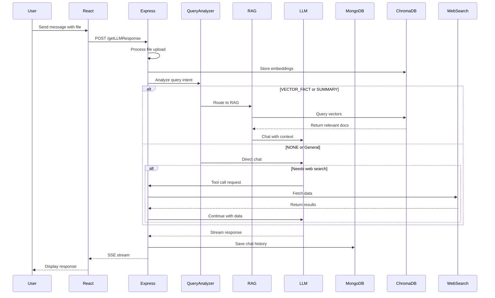

# Technical Documentation - NodeExpressReactLLM

**Version:** 1.0.1  
**Last Updated:** June 21, 2026  
**Author:** Ramesh Shrestha

---

## Table of Contents

1. [System Architecture](#system-architecture)
2. [Recent Improvements](#recent-improvements)
3. [Backend (llmserver)](#backend-llmserver)
4. [Frontend (webllm)](#frontend-webllm)
5. [Database Schemas](#database-schemas)
6. [API Reference](#api-reference)
7. [RAG System](#rag-system)
8. [File Processing Pipeline](#file-processing-pipeline)
9. [Tool Calling Mechanism](#tool-calling-mechanism)
10. [UI/UX Enhancements](#uiux-enhancements)
11. [Deployment](#deployment)
12. [Development Guide](#development-guide)

---

## System Architecture

### High-Level Overview

The application follows a three-tier architecture with clear separation between presentation, business logic, and data layers.

**Architecture Diagram:**



### Component Interaction Flow



---

## Recent Improvements

### Version 1.0.1 Updates (June 2026)

#### 1. **Avatar Color Fix**
**Problem:** Material-UI Avatar components weren't respecting Tailwind CSS classes.

**Solution:**
```jsx
// Before (not working)
<Avatar className="bg-green-600">

// After (working)
<Avatar sx={{ bgcolor: '#16a34a' }}>
```

**Impact:** Consistent green background color for all chat avatars.

#### 2. **Code Block Copy Functionality**
**Feature:** Automatic copy-to-clipboard for all code blocks in LLM responses.

**Implementation:**
- Dynamic button injection via useEffect
- Visual feedback with icon change
- 2-second confirmation display
- Cross-browser clipboard API support

**Code:**
```javascript
useEffect(() => {
    const addCopyButtons = () => {
        const codeBlocks = document.querySelectorAll('pre code');
        codeBlocks.forEach((codeBlock) => {
            const pre = codeBlock.parentElement;
            if (pre.querySelector('.copy-code-button')) return;
            
            const copyButton = document.createElement('button');
            copyButton.className = 'copy-code-button';
            copyButton.addEventListener('click', async () => {
                await navigator.clipboard.writeText(codeBlock.textContent);
                // Show checkmark feedback
            });
            pre.appendChild(copyButton);
        });
    };
    addCopyButtons();
}, [chatList, latestChatList]);
```

#### 3. **Custom Scrollbar Styling**
**Improvements:**
- Removed default arrow buttons
- Transparent track background
- Semi-transparent gray thumb
- Smooth hover effects
- Cross-browser support (WebKit + Firefox)

**CSS:**
```css
* {
  scrollbar-width: thin;
  scrollbar-color: rgba(156, 163, 175, 0.5) transparent;
}

*::-webkit-scrollbar {
  width: 8px;
}

*::-webkit-scrollbar-thumb {
  background: rgba(156, 163, 175, 0.5);
  border-radius: 4px;
}

*::-webkit-scrollbar-button {
  display: none;
}
```

#### 4. **Theme Toggle Relocation**
**Change:** Moved theme toggle from App.jsx to CenterContent header.

**Benefits:**
- Better accessibility
- Positioned next to Help button
- Purple gradient for visual distinction
- Dynamic icon (sun/moon)

#### 5. **Dark Mode as Default**
**Update:** Application now starts in dark mode by default.

**Implementation:**
```javascript
const [theme, setTheme] = useState(localStorage.getItem('theme') || 'dark');
```

**Rationale:** Better initial user experience, reduced eye strain.

#### 6. **JSDoc Documentation**
**Added:** Comprehensive JSDoc comments to core files.

**Example:**
```javascript
/**
 * DataProvider Component
 * @component
 * @param {Object} props - Component props
 * @param {React.ReactNode} props.children - Child components
 * @returns {JSX.Element} Provider component with context
 * @description Provides global state management for the application
 */
const DataProvider = ({ children }) => {
    // Implementation
};
```

---

## Backend (llmserver)

### Core Architecture

The backend is built with **Express.js** and follows a modular architecture with clear separation of concerns.

#### Directory Structure

```
llmserver/
├── index.js                    # Main server entry point
├── mongodb.js                  # MongoDB connection handler
├── websearch.js               # Web search integration
├── queueCache.js              # Request queue management
├── LLM/
│   ├── normalchat.js          # Standard chat handlers
│   ├── streamchat.js          # Streaming response handler
│   ├── embedding.js           # Vector embedding operations
│   └── tools.js               # Tool definitions for function calling
├── routes/
│   ├── handleLLMCall.js       # Main chat route handler
│   ├── chatHistoryDB.js       # Chat CRUD operations
│   └── getDetailFromURL.js    # URL content extraction
├── FileHandlers/
│   └── fileManager.js         # File processing (PDF/DOCX/TXT)
├── MongoModels/
│   └── ChatMessageLLMModel.js # MongoDB schema definitions
└── uploads/                   # Temporary file storage
```

### Key Features Implementation

#### 1. Query Analysis & Routing

The system intelligently routes queries based on their intent:

**Route Types:**
- **VECTOR_FACT**: Specific facts, numbers, localized rules → Uses semantic search
- **SUMMARY**: High-level overview, themes → Retrieves all documents
- **NONE**: General conversation, math, coding → Direct LLM response

**Implementation:**
```javascript
/**
 * Analyzes user query to determine optimal routing strategy
 * @async
 * @param {string} modelName - The LLM model to use for analysis
 * @param {string} userQuery - The user's question
 * @returns {Promise<Object>} Route decision object
 */
const analyzeUserQuery = async (modelName, userQuery) => {
  const schema = {
    "type": "object",
    "properties": {
      "route": {
        "type": "string",
        "enum": ["VECTOR_FACT", "SUMMARY", "NONE"]
      }
    },
    "required": ["route"]
  };
  
  const response = await ollama.chat({
    model: modelName,
    messages: [
      { role: 'system', content: systemInstruction },
      { role: 'user', content: userMessage }
    ],
    format: schema
  });
  
  return JSON.parse(response.message.content);
}
```

#### 2. Streaming Response Handler

**Server-Sent Events (SSE) Implementation:**
- Real-time token streaming
- Tool call interruption and continuation
- Automatic chat history persistence
- Error recovery

**Key Code:**
```javascript
if (stream) {
  res.setHeader('Content-Type', 'text/event-stream');
  res.setHeader('Cache-Control', 'no-cache');
  res.setHeader('Connection', 'keep-alive');
  
  for await (const chunk of response) {
    const content = chunk?.message?.content || "";
    res.write(`data: ${JSON.stringify({ content })}\n\n`);
    
    if (chunk.done) {
      res.end(`end: ${chunk.done}\n\n`);
    }
  }
}
```

#### 3. File Processing Pipeline

**Supported Formats:**
- PDF (via `pdf-parse`)
- DOCX (via `mammoth`)
- TXT (native Node.js)
- Images (JPEG, PNG, GIF)

**Processing Flow:**
1. Save file temporarily
2. Extract text based on type
3. Chunk text with overlap (1000 chars, 50 overlap)
4. Generate embeddings
5. Store in ChromaDB
6. Clean up temporary files

#### 4. RAG System

**Vector Database Configuration:**
```javascript
const chroma = new ChromaClient({
  host: "localhost",
  port: 27011,
  ssl: false
});

const embedder = new OllamaEmbeddingFunction({
  url: "http://localhost:11434",
  model: "nomic-embed-text:latest"
});
```

**Semantic Search:**
- Generates query embeddings
- Performs cosine similarity search
- Filters by distance threshold (0.5)
- Returns top 5 most relevant chunks

#### 5. Tool Calling

**Web Search Integration:**
- Automatic detection of information needs
- Real-time web search via Ollama API
- Seamless integration with LLM responses
- Fallback for non-tool models

---

## Frontend (webllm)

### Architecture

Built with **React 19** and **Material-UI**, following a component-based architecture with centralized state management.

#### Directory Structure

```
webllm/
├── src/
│   ├── App.jsx                    # Main application component
│   ├── main.jsx                   # React DOM entry point
│   ├── index.css                  # Global styles with custom scrollbar
│   ├── Components/
│   │   ├── CenterContent.jsx     # Main chat interface
│   │   ├── ChatContainer.jsx     # Message display container
│   │   ├── ChatHistory.jsx       # Sidebar chat list
│   │   ├── ChatList.jsx          # Chat session list
│   │   ├── RightContent.jsx      # Settings panel
│   │   ├── AttachmentPopover.jsx # File upload UI
│   │   ├── SystemMessageBox.jsx  # System prompt editor
│   │   ├── HelpDialog.jsx        # Help and instructions
│   │   ├── BusyBar.jsx           # Loading indicator
│   │   ├── AddNewChat.jsx        # New chat dialog
│   │   └── ConfirmationDialog.jsx # Reusable confirmation
│   └── Dataprovider/
│       ├── DataContext.jsx       # Global state management
│       └── LocalStorage.js       # Browser storage utilities
├── public/
│   ├── index.html                # HTML template
│   └── myicon.png                # App icon
├── Dockerfile                    # Production container
├── nginx.conf                    # Nginx configuration
├── vite.config.js                # Vite configuration
├── tailwind.config.js            # Tailwind configuration
└── postcss.config.js             # PostCSS configuration
```

### State Management

**Context Provider (DataContext.jsx):**
```javascript
/**
 * @typedef {Object} DataContextValue
 * @property {Array} models - Available LLM models
 * @property {string} selectedModel - Currently selected model
 * @property {Function} setSelectedModel - Update selected model
 * @property {boolean} streamResponse - Streaming preference
 * @property {Function} setStreamResponse - Toggle streaming
 * @property {string} theme - Current theme (light/dark)
 * @property {Function} setTheme - Update theme
 * @property {Array} chats - All chat sessions
 * @property {string} selectedChatId - Active chat ID
 * @property {Function} getChatList - Fetch chat list
 */
```

**Local Storage:**
- Persists user preferences
- Caches chat history
- Stores system messages
- Enables offline functionality

### Key Components

#### 1. CenterContent.jsx
**Main chat interface featuring:**
- Real-time message streaming
- File attachment support (images, PDFs, DOCX)
- URL content extraction
- Voice input and text-to-speech
- System message configuration
- Chat history management
- Code block syntax highlighting with copy functionality
- Theme toggle button
- Help dialog access

**Key Functions:**
```javascript
/**
 * Handles message submission to LLM
 * @async
 * @param {Event} oEvent - Submit event
 * @returns {Promise<void>}
 */
const handleSubmit = async (oEvent) => {
    // File validation
    // Build FormData
    // Stream or non-stream response
    // Update chat history
    // Clean up
};

/**
 * Adds copy buttons to all code blocks
 * @function
 */
useEffect(() => {
    const addCopyButtons = () => {
        // Find all code blocks
        // Add copy button
        // Handle clipboard API
    };
    addCopyButtons();
}, [chatList, latestChatList]);
```

#### 2. RightContent.jsx
**Settings and configuration panel:**
- Model selection dropdown with capabilities display
- Voice selection for TTS
- Streaming response toggle
- Auto-read response option
- Chat list management
- New chat creation

#### 3. ChatList.jsx
**Chat history sidebar:**
- List of all chat sessions
- Chat selection and switching
- Delete chat functionality
- Timestamp display with relative time

#### 4. HelpDialog.jsx
**Interactive help and instructions:**
- Feature explanations
- Keyboard shortcuts
- Usage tips
- Model capabilities

---

## Database Schemas

### MongoDB Schema

```javascript
const ChatMessageSchema = new mongoose.Schema({
  title: {
    type: String,
    required: true,
    trim: true
  },
  UserId: {
    type: String,
    required: true,
    default: "localUser"
  },
  SystemMessage: {
    type: String,
    default: "You are a helpful assistant."
  },
  ChatID: {
    type: String,
    required: true,
    unique: true,
    index: true
  },
  children: [{
    userName: {
      type: String,
      required: true,
      enum: ['User', 'Assistant']
    },
    Message: {
      type: String,
      required: true
    },
    Attachments: String,
    addedURL: String,
    createdAt: {
      type: Date,
      default: Date.now
    }
  }]
}, {
  timestamps: true
});
```

### ChromaDB Collections

**Collection Structure:**
- Name: `ollama_ramesh_1`
- Embedding Function: Ollama nomic-embed-text
- Distance Metric: Cosine similarity

**Document Metadata:**
```javascript
{
  source: "filename.pdf",
  category: "localdevelopment",
  uploadedAt: "2026-06-21T14:00:00Z",
  chatId: "chat-uuid-123",
  "hnsw:space": "cosine"
}
```

---

## API Reference

### Base URL
- **Development**: `http://localhost:5000`
- **Production**: `http://your-domain.com`

### Core Endpoints

#### 1. Get LLM Response

**Endpoint:** `POST /dataprovider/getLLMResponse`

**Description:** Main chat endpoint supporting streaming and non-streaming responses with file uploads.

**Request:**
```http
POST /dataprovider/getLLMResponse HTTP/1.1
Content-Type: multipart/form-data

modelName: granite4.1:8b
prompt: What is the capital of France?
systemPrompt: You are a helpful assistant.
chatHistory: [{"role":"user","content":"Hello"}]
stream: true
selectedChatId: 507f1f77bcf86cd799439011
addedURL: https://example.com/article
attachments: [file1.pdf, file2.txt]
```

**Response (Streaming):**
```http
HTTP/1.1 200 OK
Content-Type: text/event-stream

data: {"content":"The"}
data: {"content":" capital"}
data: {"content":" of"}
data: {"content":" France"}
data: {"content":" is"}
data: {"content":" Paris."}
end: true
```

**Response (Non-Streaming):**
```json
{
  "llmresponse": "The capital of France is Paris.",
  "selectedChatId": "507f1f77bcf86cd799439011"
}
```

#### 2. Get Available Models

**Endpoint:** `GET /dataprovider/getModels`

**Response:**
```json
[
  {
    "name": "granite4.1:8b",
    "model": "granite4.1:8b",
    "capabilities": ["chat", "tools", "vision"]
  }
]
```

#### 3. Server Status

**Endpoint:** `GET /dataprovider/status`

**Response:**
```json
{
  "dbConnected": true,
  "status": "ok",
  "uptime": 3600.5,
  "memory": {
    "rss": 52428800,
    "heapTotal": 20971520,
    "heapUsed": 15728640
  },
  "timestamp": "2026-06-21T14:00:00.000Z"
}
```

#### 4. Chat History Operations

| Endpoint | Method | Description |
|----------|--------|-------------|
| `/dataprovider/chathistory` | GET | Get all chats |
| `/dataprovider/chathistory/:id/chatItem` | GET | Get chat messages |
| `/dataprovider/chathistory/:id/chatItem` | POST | Add message |
| `/dataprovider/chathistory/:id/clear` | POST | Clear chat |
| `/dataprovider/chathistory/:chatID` | DELETE | Delete chat |
| `/dataprovider/chathistory/:chatID` | PATCH | Update chat |
| `/dataprovider/chathistory` | POST | Create chat |

---

## RAG System

### Architecture

The RAG (Retrieval-Augmented Generation) system combines vector search with LLM generation for accurate document-based Q&A.

### Embedding Process

1. **Document Ingestion**: File upload → Text extraction → Chunking
2. **Embedding Generation**: Ollama generates embeddings using nomic-embed-text
3. **Vector Storage**: Store in ChromaDB with metadata

### Retrieval Process

1. **Query Embedding**: Generate embedding for user query
2. **Similarity Search**: Perform cosine similarity search
3. **Distance Filtering**: Filter results by threshold (0.5)
4. **Context Augmentation**: Add relevant context to system prompt

### Performance Optimization

**Chunking Strategy:**
- Size: 1000 characters
- Overlap: 50 characters
- Balance between granularity and context

**Distance Threshold:**
- Value: 0.5 (cosine distance)
- Filters irrelevant results
- Tunable based on precision/recall needs

**Result Limit:**
- Default: 5 chunks
- Balances context size and relevance

---

## File Processing Pipeline

### Supported Formats

| Format | Extension | Library | Max Size |
|--------|-----------|---------|----------|
| PDF | .pdf | pdf-parse | 10MB |
| Word | .docx | mammoth | 10MB |
| Text | .txt | fs | 10MB |
| Image | .jpg, .png, .gif | Buffer | 10MB |

### Processing Flow

1. File upload via Multer
2. Type detection and validation
3. Text extraction (format-specific)
4. Chunking with overlap
5. Embedding generation
6. ChromaDB storage
7. Temporary file cleanup

---

## Tool Calling Mechanism

### Tool Definition

```javascript
{
  type: 'function',
  function: {
    name: 'getDetailsFromWeb',
    description: 'Fetch current information from the web',
    parameters: {
      type: 'object',
      properties: {
        query_topic: {
          type: 'string',
          description: 'The search query'
        }
      },
      required: ['query_topic']
    }
  }
}
```

### Execution Flow

1. LLM detects need for external information
2. Generates tool call request
3. Handler executes web search
4. Results added to chat history
5. LLM continues with enhanced context
6. Final response streamed to user

---

## UI/UX Enhancements

### Theme System

**Dark Mode (Default):**
- Modern dark theme with gray tones
- Reduced eye strain
- Better for low-light environments

**Light Mode:**
- Clean light theme with white backgrounds
- High contrast for readability

**Implementation:**
```javascript
const [theme, setTheme] = useState(localStorage.getItem('theme') || 'dark');

useEffect(() => {
    localStorage.setItem('theme', theme);
}, [theme]);
```

### Custom Scrollbar

**Features:**
- 8px thin width
- Transparent track
- Semi-transparent gray thumb
- Smooth hover effects
- No arrow buttons
- Cross-browser support

### Code Block Enhancements

**Copy Functionality:**
- Automatic button injection
- Clipboard API integration
- Visual feedback (icon change)
- 2-second confirmation
- Error handling

**Styling:**
```css
.copy-code-button {
  position: absolute;
  top: 0.5rem;
  right: 0.5rem;
  padding: 0.5rem;
  background: rgba(255, 255, 255, 0.1);
  border: 1px solid rgba(255, 255, 255, 0.2);
  border-radius: 0.375rem;
  color: #9ca3af;
  cursor: pointer;
  transition: all 0.2s ease;
}
```

### Avatar Styling

**Material-UI Integration:**
```jsx
<Avatar sx={{ bgcolor: '#16a34a' }}>
  {chat.userName === 'User' ? <PersonIcon /> : <AssistantIcon />}
</Avatar>
```

---

## Deployment

### Docker Deployment

**Docker Compose:**
```yaml
services:
  llmserver:
    build: ./llmserver
    ports:
      - "5000:5000"
    environment:
      - OLLAMA_BASE_URL=http://host.docker.internal:11434
      - MONGODB_URI=mongodb://mongodb:27017/llmchat
    restart: always

  webllm:
    build: ./webllm
    ports:
      - "80:80"
    depends_on:
      - llmserver
    restart: always

  mongodb:
    image: mongo:latest
    ports:
      - "27017:27017"
    volumes:
      - mongodb_data:/data/db

  chromadb:
    image: chromadb/chroma:latest
    ports:
      - "27011:8000"
    volumes:
      - chromadb_data:/chroma/chroma

volumes:
  mongodb_data:
  chromadb_data:
```

### Environment Variables

**Backend (.env):**
```env
PORT=5000
OLLAMA_BASE_URL=http://localhost:11434
MONGODB_URI=mongodb://localhost:27017/llmchat
ENVIRONMENT=production
DEBUG_MODE=false
```

### Production Considerations

1. **Security**: HTTPS, JWT auth, CORS restrictions
2. **Performance**: Caching, connection pooling, CDN
3. **Monitoring**: Logging, health checks, alerting
4. **Scalability**: Load balancing, Redis, message queues

---

## Development Guide

### Setup

```bash
# Install dependencies
npm install

# Configure environment
cp llmserver/.env.example llmserver/.env

# Pull Ollama models
ollama pull granite4.1:8b
ollama pull nomic-embed-text:latest

# Start services
npm run dev:backend  # Terminal 1
npm run dev:frontend # Terminal 2
```

### Development Workflow

1. Follow ES6+ module syntax
2. Use async/await for async operations
3. Implement proper error handling
4. Add JSDoc comments for functions
5. Test with multiple models
6. Validate file uploads
7. Check responsive design

### Code Style Guidelines

**JSDoc Comments:**
```javascript
/**
 * Brief description of function
 * @async
 * @param {Type} paramName - Parameter description
 * @returns {Promise<Type>} Return value description
 * @throws {Error} Error conditions
 */
```

**Error Handling:**
```javascript
try {
    // Operation
} catch (error) {
    console.error('Operation failed:', error);
    res.status(500).json({ error: error.message });
}
```

### Debugging

**Backend:**
- Enable DEBUG_MODE=true
- Use colored console logs
- Monitor Ollama logs
- Check MongoDB connections

**Frontend:**
- React DevTools
- Network tab for API calls
- Console logging
- Component state inspection

### Common Issues

**Ollama Connection Failed:**
```bash
ollama serve
curl http://localhost:11434/api/tags
```

**MongoDB Connection Error:**
```bash
docker start mongodb
mongosh
```

**ChromaDB Not Found:**
```bash
docker run -d -p 27011:8000 chromadb/chroma
```

**File Upload Fails:**
- Check file size (max 10MB)
- Verify file type
- Ensure uploads/ directory exists
- Check disk space

---

## Technology Stack

### Backend
- **Node.js** 18+ with ES Modules
- **Express.js** 5.2.1 - Web framework
- **Ollama** 0.6.3 - LLM integration
- **MongoDB** with Mongoose 9.6.1 - Chat persistence
- **ChromaDB** 3.3.3 - Vector database
- **Multer** 2.1.1 - File upload handling
- **Axios** 1.13.2 - HTTP client
- **Cheerio** 1.2.0 - Web scraping
- **pdf-parse** 2.4.5 - PDF text extraction
- **mammoth** 1.12.0 - DOCX processing

### Frontend
- **React** 19.2.0 - UI framework
- **Vite** 7.2.4 - Build tool
- **Material-UI** 7.3.6 - Component library
- **@emotion** - CSS-in-JS styling
- **Tailwind CSS** 4.1.0 - Utility-first CSS
- **javascript-time-ago** 2.5.11 - Time formatting

### Infrastructure
- **Docker** & **Docker Compose** - Containerization
- **Nginx** - Frontend web server (production)

---

## Performance Metrics

### Response Times
- **Simple Query**: < 1s
- **RAG Query**: 2-3s
- **Tool Call**: 3-5s
- **File Upload**: 1-2s per MB

### Resource Usage
- **Memory**: ~200MB (backend), ~100MB (frontend)
- **CPU**: 10-30% during inference
- **Storage**: ~1GB for embeddings (per 1000 documents)

---

## Security Best Practices

1. **Input Validation**: Sanitize all user inputs
2. **File Validation**: Check type, size, content
3. **Rate Limiting**: Prevent API abuse
4. **CORS**: Restrict origins in production
5. **Environment Variables**: Never commit secrets
6. **HTTPS**: Use SSL/TLS in production
7. **Authentication**: Implement JWT or OAuth
8. **Error Messages**: Don't expose sensitive info

---

## Conclusion

This technical documentation provides comprehensive coverage of the NodeExpressReactLLM application architecture, implementation details, recent improvements, and deployment strategies. The application combines modern web technologies with advanced AI capabilities to deliver a powerful, user-friendly chat interface.

For user-friendly quick start instructions, refer to [README.md](./Readme.md).

**Maintained by:** Ramesh Shrestha  
**Contact:** fx_ra@hotmail.com  
**Repository:** https://github.com/RameshShrestha/NodeExpressReactLLM

---

**Last Updated:** June 21, 2026  
**Version:** 1.0.1